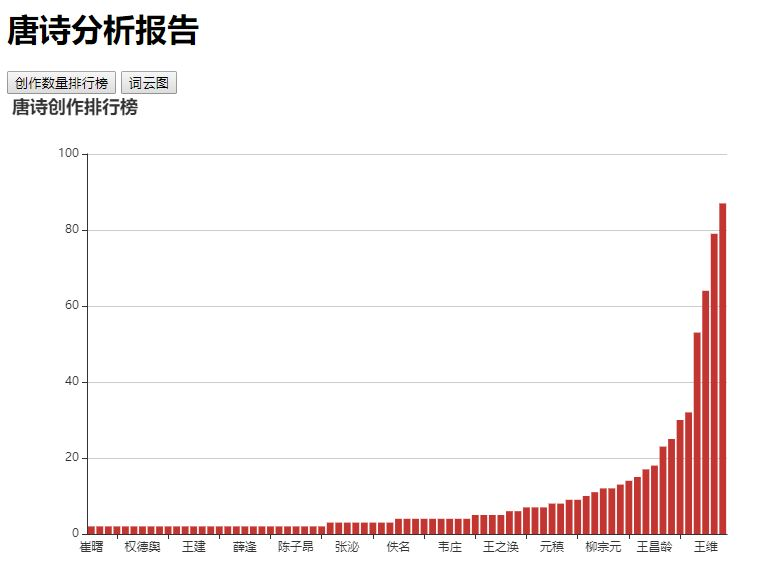

### 项目名称
唐诗分析系统

### 项目描述
本系统主要是抓取互联网上的唐诗，然后进行数据的采集，清洗，存储和解析等操作，分析出来谁写的古诗比较多，李白，杜甫还是孟浩然？顺便看看各位诗人最喜欢用的词语是什么，是悲伤的多还是欢快的多？

### 涉及技术
- Java基础
  - 面向对象
  - 多线程
  - 集合框架
  - 设计模式
  - 数据库和JDBC编程
  - 常用类以及Stream流、Lambda表达式
- 第三方
  - htmlUnit --- 网页解析工具
  - Ansj --- 文本分词和解析
  - Sparkjava --- web容器
  - Druid --- 数据库连接池
 - 前端
   - HTML
   - JavaScript
   - JQuery
   - Echarts
- 工具
  - IDEA
  - Maven
  - GitHub  

### 实现功能
+ 分析各位诗人的创作数量，以柱状图的形式展示
+ 分析各位诗人的常用词汇，以词云的形式显示

### 具体实现

### 项目效果

### 项目职责
- 开发功能

  - 从网页爬取数据crawler
  - 进行数据分析pipeline
  - web部分与同学合作完成

- 进行测试
